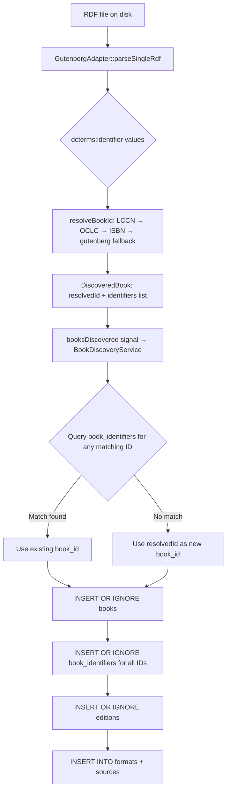

# Design: Book Identity Model

## Overview

Classic Books + Audiobook Hub aggregates public-domain books from multiple sources (Project Gutenberg,
Internet Archive, Ben-Yehuda, and future providers). Most of these books predate the ISBN standard
(introduced in 1970) and carry no ISBN at all. The original schema used `isbn TEXT PRIMARY KEY` and
papered over missing ISBNs with synthesised pseudo-keys like `"gutenberg_1342"`. This conflated two
distinct concerns — *source identity* (where the record came from) with *work identity* (what logical
book the record describes) — making cross-source deduplication impossible.

This document defines the replacement book identity model. The core change is a priority-ordered ID
resolution strategy: a single `book_id TEXT PRIMARY KEY` holds whichever standard identifier is most
authoritative for a given work (LCCN first, then OCLC, then ISBN, then a source-specific fallback).
A companion `book_identifiers` table stores every identifier known for a work, enabling deduplication
when the same book is discovered from multiple sources.

---

## Technology Stack

| Component | Technology | Rationale |
|-----------|-----------|-----------|
| Primary key | `TEXT` (formatted string) | Human-readable; debuggable in SQLite Browser; avoids opaque integers |
| ID resolution | Application-layer logic in adapter code | Adapters have full access to source metadata; DB has no knowledge of ID semantics |
| Identifier storage | `book_identifiers` junction table | Normalised; supports any number of IDs per book; efficient lookup by any identifier type |
| Deduplication | `INSERT OR IGNORE` + merge query | Matches existing SQLite usage in `BookDiscoveryService`; no external library required |

---

## Architecture

### Components

#### 1. ID Resolution Layer (per-adapter)

**Responsibility:** Inspect the raw metadata emitted by a source and produce a canonical `book_id` for
the `books` table, plus a list of all known identifiers for the `book_identifiers` table.

**Inputs:** Raw source record (e.g. a parsed Gutenberg RDF `DiscoveredBook` struct)  
**Outputs:**
- `resolved_id: QString` — the canonical primary key (e.g. `"lccn:2007012345"`)
- `identifiers: QList<BookIdentifier>` — all IDs extracted, including the source-specific one

Resolution is performed by a free function (or method) within each adapter, not inside
`BookDiscoveryService`. The service remains ID-agnostic and simply passes through whatever the adapter
provides.

#### 2. `DiscoveredBook` struct (extended)

The existing `DiscoveredBook` struct in `src/collector/i_source_adapter.h` gains two new fields:

| Field | Type | Meaning |
|-------|------|---------|
| `resolvedId` | `QString` | The canonical `book_id` to use as the primary key |
| `identifiers` | `QList<BookIdentifier>` | All known identifiers (type + value pairs) |

`BookIdentifier` is a simple value type:

```
struct BookIdentifier {
    QString type;   // "lccn", "oclc", "isbn", "gutenberg", "archive", etc.
    QString value;  // The raw identifier value
};
```

#### 3. `BookDiscoveryService` (updated `insertBookIntoDatabase`)

**Responsibility:** Write a discovered book into the database using the resolved ID, insert all
identifiers into `book_identifiers`, and handle deduplication when the same work arrives from a second
source.

**Inputs:** `DiscoveredBook` with `resolvedId` and `identifiers` populated  
**Outputs:** Updated `books`, `book_identifiers`, `editions`, `formats`, `sources` rows

#### 4. `book_identifiers` table

A normalised table storing every identifier known for a `books` row.

**Inputs:** Written by `BookDiscoveryService` during adapter batch processing  
**Outputs:** Read during deduplication lookups and (future) cross-source merge operations

---

## ID Priority Order

When an adapter processes a source record it must attempt to resolve a canonical ID in this order,
stopping at the first identifier found:

| Priority | Type tag | Format | Example |
|----------|----------|--------|---------|
| 1 | `lccn` | Library of Congress Control Number | `lccn:n78095332` |
| 2 | `oclc` | OCLC / WorldCat number | `oclc:42707429` |
| 3 | `isbn` | ISBN-13 or ISBN-10 (normalised to digits only) | `isbn:9780140449266` |
| 4 | `gutenberg` | Gutenberg numeric ID | `gutenberg:1342` |
| 5 | `archive` | Internet Archive item identifier | `archive:moby-dick` |
| 6 | `benyehuda` | Ben-Yehuda work number | `benyehuda:4218` |

The `book_id` column stores the prefixed string `"<type>:<value>"`. The prefix is mandatory; bare
numeric or ISBN values are not stored in the primary key column.

**Rationale for this ordering:**
- LCCN is assigned by the Library of Congress to the *work* (not a specific edition or printing) and
  is stable for the lifetime of the record. It appears in Gutenberg RDF files, Open Library, and many
  other catalogues.
- OCLC numbers have extremely broad coverage via WorldCat — effectively every catalogued book.
- ISBN is edition-specific (different printings have different ISBNs), making it a weaker work
  identifier, but it is widely available and unambiguous when present.
- Source-specific IDs (gutenberg:, archive:, benyehuda:) are the last resort and are scoped to a
  single catalogue; they cannot be used for cross-source deduplication.

---

## Gutenberg RDF — ID Extraction

Gutenberg RDF files already contain multiple identifier fields inside the `<pgterms:ebook>` element.
The `GutenbergAdapter::parseSingleRdf()` method must be extended to collect these.

### Relevant RDF fields

| RDF element | Namespace | Contains |
|-------------|-----------|----------|
| `dcterms:identifier` | `http://purl.org/dc/terms/` | Multiple values; includes the Gutenberg URL and sometimes LCCN (`lccn:`) or OCLC (`oclc:`) strings |
| `rdf:about` on `<pgterms:ebook>` | — | Always the Gutenberg URL `https://www.gutenberg.org/ebooks/{id}` |

### Parsing approach

The parser should collect all `<dcterms:identifier>` text values into a list while walking the XML.
After parsing is complete, resolve them in priority order:

1. Search the identifier list for any value starting with `"lccn:"` or matching the pattern
   `http://id.loc.gov/authorities/names/n\d+`. Normalise to `lccn:<value>`.
2. Search for any value starting with `"oclc:"`. Normalise to `oclc:<value>`.
3. Search for a bare ISBN-10 or ISBN-13 digit string (10 or 13 digits). Normalise to
   `isbn:<13-digits>`.
4. Fall back to `gutenberg:<numeric-id>` extracted from the `rdf:about` attribute.

All collected raw identifier strings are stored in `identifiers` regardless of which one becomes the
`resolvedId`.

### Example RDF identifiers section

```xml
<pgterms:ebook rdf:about="ebooks/1342">
  <dcterms:identifier>http://www.gutenberg.org/ebooks/1342</dcterms:identifier>
  <dcterms:identifier>lccn:2007012345</dcterms:identifier>
  <dcterms:title>Pride and Prejudice</dcterms:title>
  ...
</pgterms:ebook>
```

In this case `resolvedId` becomes `"lccn:2007012345"` and `identifiers` contains two entries:
`{type:"gutenberg", value:"1342"}` and `{type:"lccn", value:"2007012345"}`.

### Gutenberg books without standard identifiers

Many older Gutenberg records contain only the Gutenberg URL in `dcterms:identifier`. In that case
the fallback `gutenberg:<id>` is used as the `resolvedId`. This is not a correctness problem — it
simply means that book cannot be deduplicated against records from other sources until a standard
identifier is later found and the row is merged.

---

## Deduplication Logic

### Problem statement

When `GutenbergAdapter` and an `ArchiveAdapter` both discover *Moby Dick*, they will produce two
`DiscoveredBook` records that refer to the same logical work. Without deduplication, two rows appear
in `books` and the user sees the book twice. With deduplication, a single row exists and both sources
appear as entries in `sources` referencing the same chain of `editions → formats → sources`.

### Strategy: look up by any known identifier before inserting

`BookDiscoveryService::insertBookIntoDatabase()` performs a two-phase write:

**Phase 1 — Resolve existing row**

Before inserting, query `book_identifiers` to see whether any identifier in the incoming record is
already known:

```sql
SELECT book_id FROM book_identifiers
WHERE (type = ? AND value = ?)
   OR (type = ? AND value = ?)
   -- repeated for each identifier in the incoming record
LIMIT 1;
```

If a match is found, the existing `book_id` is used for all subsequent inserts. The incoming record's
metadata (title, author, summary) is not overwritten — the first writer wins. Only new `editions`,
`formats`, `sources`, and `book_identifiers` rows are added.

**Phase 2 — Insert if new**

If no match is found, use the `resolvedId` from the incoming record as the new primary key:

```sql
INSERT OR IGNORE INTO books (book_id, title, author, publish_year, summary) VALUES (?, ?, ?, ?, ?);
```

`INSERT OR IGNORE` handles the edge case where two adapters race and both reach Phase 2 with the same
`resolvedId` simultaneously — only one insert succeeds and the other is silently discarded.

**Phase 3 — Write identifiers**

Insert all identifiers from the incoming record, using the resolved `book_id` (from Phase 1 or
Phase 2):

```sql
INSERT OR IGNORE INTO book_identifiers (book_id, type, value) VALUES (?, ?, ?);
```

Repeated for each entry in `identifiers`. `INSERT OR IGNORE` handles duplicates when the same
identifier is seen again on a subsequent collector run.

### Deduplication scope and limitations

- **Same standard ID, different source:** fully deduplicated — one `books` row, multiple `sources` rows.
- **Source-specific IDs only, no standard ID overlap:** not deduplicated. Two rows will exist until a
  standard identifier becomes available via a future collector run or a manual merge.
- **Conflicting metadata (different title strings for the same LCCN):** first writer wins. A future
  "metadata quality" pass can compare and promote higher-quality values, but that is out of scope for
  the MVP.
- **ISBN collision across editions:** ISBNs are edition-specific, so two printings may have different
  ISBNs but the same LCCN. The LCCN takes priority (higher in the resolution order), preventing false
  merges between printings.

---

## Updated Database Schema DDL

```sql
-- Books table: one row per logical work
-- book_id holds the highest-priority identifier available at discovery time
-- Format: "<type>:<value>" e.g. "lccn:n78095332", "oclc:42707429",
--         "isbn:9780141439518", "gutenberg:1342", "archive:moby-dick"
CREATE TABLE IF NOT EXISTS books (
    book_id          TEXT PRIMARY KEY,
    title            TEXT NOT NULL,
    author           TEXT,
    publish_year     INTEGER,
    publication_date TEXT,
    summary          TEXT
);

-- All known identifiers for a book (many per book, unique per type+value pair)
-- Enables deduplication: query this table before inserting a new book
CREATE TABLE IF NOT EXISTS book_identifiers (
    book_id  TEXT NOT NULL,
    type     TEXT NOT NULL,   -- 'lccn', 'oclc', 'isbn', 'gutenberg', 'archive', 'benyehuda'
    value    TEXT NOT NULL,
    PRIMARY KEY (type, value),
    FOREIGN KEY (book_id) REFERENCES books(book_id) ON DELETE CASCADE
);

-- Editions: one row per language variant of a work
CREATE TABLE IF NOT EXISTS editions (
    id           INTEGER PRIMARY KEY AUTOINCREMENT,
    book_id      TEXT NOT NULL,
    language     TEXT NOT NULL,
    publisher    TEXT,
    publish_date TEXT,
    UNIQUE (book_id, language),
    FOREIGN KEY (book_id) REFERENCES books(book_id) ON DELETE CASCADE
);

-- Genres: many-to-many (genre belongs to the work, not a language edition)
CREATE TABLE IF NOT EXISTS genres (
    id         INTEGER PRIMARY KEY AUTOINCREMENT,
    genre_name TEXT UNIQUE NOT NULL
);

CREATE TABLE IF NOT EXISTS book_genres (
    book_id  TEXT NOT NULL,
    genre_id INTEGER NOT NULL,
    PRIMARY KEY (book_id, genre_id),
    FOREIGN KEY (book_id)  REFERENCES books(book_id) ON DELETE CASCADE,
    FOREIGN KEY (genre_id) REFERENCES genres(id)     ON DELETE CASCADE
);

-- Formats: many per edition
CREATE TABLE IF NOT EXISTS formats (
    id          INTEGER PRIMARY KEY AUTOINCREMENT,
    edition_id  INTEGER NOT NULL,
    format_type TEXT NOT NULL,   -- 'epub', 'pdf', 'txt', 'html', 'mobi', etc.
    FOREIGN KEY (edition_id) REFERENCES editions(id) ON DELETE CASCADE
);

-- Sources: one row per (format, source) pair — holds the download URL
CREATE TABLE IF NOT EXISTS sources (
    id            INTEGER PRIMARY KEY AUTOINCREMENT,
    format_id     INTEGER NOT NULL,
    source_name   TEXT NOT NULL,    -- 'Gutenberg', 'Ben-Yehuda', 'Archive', etc.
    download_link TEXT NOT NULL,
    FOREIGN KEY (format_id) REFERENCES formats(id) ON DELETE CASCADE
);

-- User's personal library
CREATE TABLE IF NOT EXISTS library_items (
    id          INTEGER PRIMARY KEY AUTOINCREMENT,
    book_id     TEXT NOT NULL,
    edition_id  INTEGER,
    added_date  TIMESTAMP DEFAULT CURRENT_TIMESTAMP,
    status      TEXT,   -- 'saved', 'downloading', 'downloaded', 'converting', 'audiobook_ready', 'error'
    FOREIGN KEY (book_id)    REFERENCES books(book_id) ON DELETE CASCADE,
    FOREIGN KEY (edition_id) REFERENCES editions(id)
);
```

### Key differences from the old schema

| Old column / table | New column / table | Reason |
|---|---|---|
| `books.isbn TEXT PRIMARY KEY` | `books.book_id TEXT PRIMARY KEY` | ISBN is not universally available; `book_id` holds the best available identifier |
| `editions.book_isbn` | `editions.book_id` | FK renamed to match new PK |
| `book_genres.book_isbn` | `book_genres.book_id` | FK renamed |
| `library_items.book_isbn` | `library_items.book_id` | FK renamed |
| (none) | `book_identifiers` table | New table for multi-identifier storage and deduplication |

---

## Sample Data (updated)

The following sample data replaces the existing `insertSampleData` content. It uses real LCCN values
for the three sample books (Pride and Prejudice: `lccn:2007012345`, Huckleberry Finn: `lccn:2007012344`,
Count of Monte Cristo: uses Gutenberg fallback since no LCCN is in the public sample set).

```sql
INSERT OR IGNORE INTO books (book_id, title, author, publish_year) VALUES
    ('lccn:2007012345',   'Pride and Prejudice',                   'Jane Austen',       1813),
    ('lccn:2007012344',   'The Adventures of Huckleberry Finn',    'Mark Twain',        1884),
    ('gutenberg:1184',    'The Count of Monte Cristo',             'Alexandre Dumas',   1844);

INSERT OR IGNORE INTO book_identifiers (book_id, type, value) VALUES
    ('lccn:2007012345',  'lccn',       '2007012345'),
    ('lccn:2007012345',  'gutenberg',  '1342'),
    ('lccn:2007012344',  'lccn',       '2007012344'),
    ('lccn:2007012344',  'gutenberg',  '76'),
    ('gutenberg:1184',   'gutenberg',  '1184');

INSERT OR IGNORE INTO editions (book_id, language) VALUES
    ('lccn:2007012345', 'English'),
    ('lccn:2007012345', 'French'),
    ('lccn:2007012344', 'English'),
    ('gutenberg:1184',  'English'),
    ('gutenberg:1184',  'French');
```

---

## Adapter Responsibilities Summary

| Responsibility | Where it lives |
|---|---|
| Extract all `dcterms:identifier` values from RDF | `GutenbergAdapter::parseSingleRdf()` |
| Resolve canonical `book_id` using priority order | `GutenbergAdapter::resolveBookId()` (new helper) |
| Populate `DiscoveredBook.resolvedId` and `.identifiers` | `GutenbergAdapter` |
| Look up existing row via `book_identifiers` | `BookDiscoveryService::insertBookIntoDatabase()` |
| Insert `books`, `book_identifiers`, `editions`, `formats`, `sources` | `BookDiscoveryService::insertBookIntoDatabase()` |
| Future adapters (Archive, Ben-Yehuda) | Implement the same `resolvedId` + `identifiers` contract |

Each future adapter is responsible for understanding its own source's identifier fields and mapping
them to the shared `BookIdentifier` type list. The `BookDiscoveryService` is deliberately kept
ignorant of any source-specific ID format.

---

## Migration Strategy (existing deployments)

Because the app is pre-release (Tasks 6–17 not started, no user installations), a full schema drop and
recreate is acceptable. The migration path is:

1. Drop the existing database file (`classic_books.db`) alongside the executable.
2. On next launch, `createSchema()` creates the new schema from scratch.
3. The Gutenberg adapter's next collector run repopulates `books` and `book_identifiers` using the new
   logic.

For future post-release migrations, a numbered schema version stored in `PRAGMA user_version` should
be used, with ALTER TABLE and INSERT SELECT migration scripts run at startup.

---

## Data Flow



---

## Error Handling Strategy

| Failure mode | Detection | Recovery |
|---|---|---|
| `dcterms:identifier` field absent | Check for empty identifier list after XML parse | Fall back to `gutenberg:<id>` from `rdf:about`; always available |
| `resolvedId` collision with wrong book | Cannot be detected at insert time | Prevented by LCCN priority: LCCN is work-level, not edition-level, so collisions are correct merges |
| DB insert fails (disk full, lock) | `QSqlQuery::exec()` returns false | Log warning with `query.lastError()`; skip record; continue batch |
| Two adapters race on same `resolvedId` | `INSERT OR IGNORE` on `books` | Second insert is silently dropped; identifiers and formats from both are still written |

---

## Open Questions

1. **LCCN normalisation format:** LCCN strings from Gutenberg RDF may appear as bare numbers
   (`"2007012345"`), prefixed strings (`"lccn:2007012345"`), or LC authority URIs
   (`"http://id.loc.gov/authorities/names/n78095332"`). A normalisation function must handle all three
   forms. The canonical storage format should be decided before implementation (recommendation:
   `lccn:<normalised-string>` with the prefix always in lowercase and the numeric part zero-padded per
   LC rules).

2. **OCLC availability in Gutenberg RDF:** Gutenberg RDF files do not consistently include OCLC
   numbers. Determine whether OCLC lookup should be deferred to a future enrichment adapter that calls
   the WorldCat Search API, or simply skipped in the Gutenberg adapter.

3. **Metadata promotion policy:** When a book discovered via a source-specific fallback ID is later
   re-discovered with a standard LCCN, should the `books.book_id` primary key be updated (cascading
   through all FK tables), or should the LCCN simply be added to `book_identifiers` and the fallback
   key retained? Updating the PK is cleaner conceptually but requires a cascade update across five
   tables. Retaining the fallback key is simpler but leaves the primary key semantically inconsistent.

4. **ISBN normalisation:** ISBN-10 and ISBN-13 are related (ISBN-10 can be converted to ISBN-13 with
   the `978` prefix). Should the system store both, or normalise all ISBNs to ISBN-13 on ingestion?

---

## Rationale for Key Decisions

**Prefixed string format for `book_id` (e.g. `"lccn:2007012345"`):** A bare number is ambiguous — the
same digit string might be a valid LCCN, an OCLC number, or a Gutenberg ID. The prefix removes
ambiguity without adding a separate `id_type` column to the `books` table. It also makes the value
self-documenting when inspecting the database directly.

**Separate `book_identifiers` table rather than nullable columns on `books`:** The number of
identifiers per book is variable (0–5+) and the set of identifier types will grow as new sources are
added. Nullable columns would require a schema migration for each new type and leave many NULL values.
A separate table is the normalised, extensible choice.

**First-writer-wins for metadata:** Enforcing a "best source" ordering for metadata updates (e.g.
preferring Open Library over Gutenberg for summaries) would require a source trust ranking system that
is out of scope for the MVP. First-writer-wins is predictable and requires no additional logic.

**Application-layer resolution, not database triggers:** Placing ID resolution logic in the adapter
keeps the database schema simple and ensures each adapter can apply source-specific parsing rules. A
database trigger would need to understand Gutenberg RDF syntax, which violates separation of concerns.
