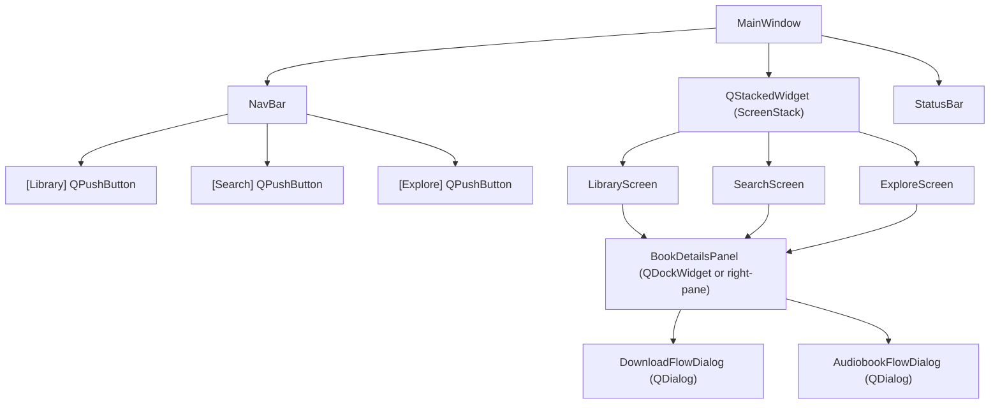
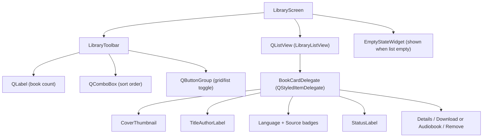
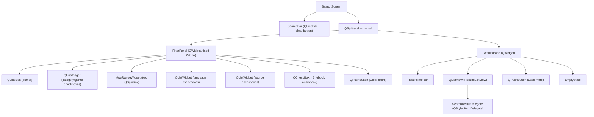
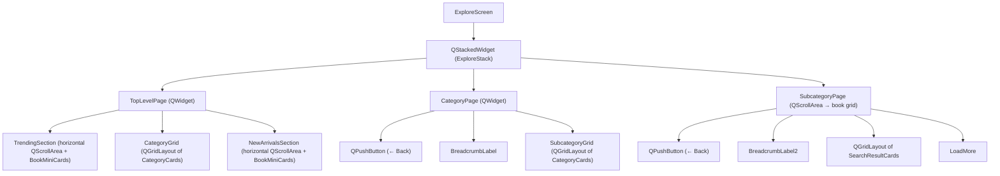
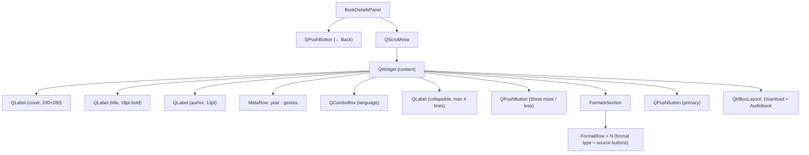
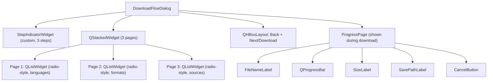
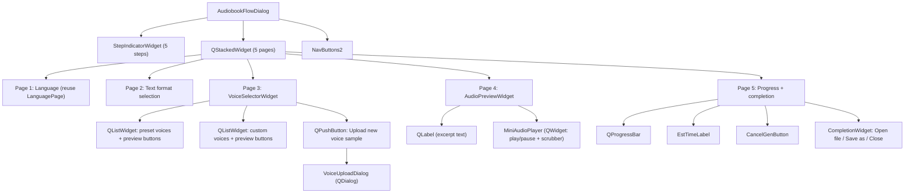

# BookHub — GUI Design Specification

**Version:** 1.0  
**Date:** 2026-04-22  
**Scope:** All unimplemented screens (Tasks 6–14): Library, Search, Explore, Book Details, Download Flow, Audiobook Flow, and shared shell/navigation.  
**Framework:** Qt6 Widgets (QMainWindow + QStackedWidget navigation model)

---

## Table of Contents

1. [Application Shell & Navigation](#1-application-shell--navigation)
2. [Library Screen](#2-library-screen)
3. [Search Screen](#3-search-screen)
4. [Explore Screen](#4-explore-screen)
5. [Book Details Panel](#5-book-details-panel)
6. [Download Flow Dialog](#6-download-flow-dialog)
7. [Audiobook Flow Dialog](#7-audiobook-flow-dialog)
8. [Shared Components & Design Tokens](#8-shared-components--design-tokens)

---

## 1. Application Shell & Navigation

### 1.1 ASCII Layout Sketch

```
┌─────────────────────────────────────────────────────────────────────┐
│  [icon]  BookHub          [_] [□] [X]         │
├─────────────────────────────────────────────────────────────────────┤
│  ┌─────────────────────────────────────────────────────────────┐    │
│  │  [Library]        [Search]        [Explore]                 │    │
│  └─────────────────────────────────────────────────────────────┘    │
│  ┌─────────────────────────────────────────────────────────────┐    │
│  │                                                             │    │
│  │              [Active Screen Content]                        │    │
│  │               (QStackedWidget)                              │    │
│  │                                                             │    │
│  └─────────────────────────────────────────────────────────────┘    │
│  ┌─────────────────────────────────────────────────────────────┐    │
│  │  [Collector: Fetching books from Gutenberg...]  [●] active  │    │
│  └─────────────────────────────────────────────────────────────┘    │
└─────────────────────────────────────────────────────────────────────┘
```

### 1.2 Component Diagram



### 1.3 Specification

**Purpose:** Provides consistent top-level navigation between the three main screens and surfaces background collector status to the user.

**User Stories:**
- As a user, I want to switch between Library, Search, and Explore with a single click so I can move quickly between tasks.
- As a user, I want to see the background collector's activity at a glance so I know when new books are being fetched.

**Layout & Regions:**

| Region | Widget Type | Sizing Policy |
|--------|-------------|---------------|
| Title bar | Native OS chrome + `QMainWindow::setWindowTitle` | Fixed by OS |
| Navigation bar | `QWidget` with `QHBoxLayout`, three `QPushButton` tabs | Fixed height (48 px), stretches horizontally |
| Screen stack | `QStackedWidget` | Expands to fill remaining space |
| Status bar | `QStatusBar` | Fixed height (24 px) |

**Navigation Model:**
- Three `QPushButton` buttons styled as tabs (checkable, exclusive via `QButtonGroup`).
- Clicking a tab calls `QStackedWidget::setCurrentIndex()`.
- The active tab has a bottom border accent (2 px, accent colour).
- Keyboard: Tab/Shift-Tab cycles between nav buttons; Enter/Space activates.

**Status Bar:**
- Left side: short text from `CollectorWorker` signals (e.g. "Syncing with Gutenberg…", "Library up to date").
- Right side: a small `QLabel` with coloured dot — green for idle, amber for active fetch, red for error.
- Updates via `Qt::QueuedConnection` from `CollectorWorker`.

**Minimum window size:** 900 × 650 px.  
**Default window size:** 1200 × 800 px.

**Design Tokens:** See Section 8.

---

## 2. Library Screen

### 2.1 ASCII Layout Sketch

```
┌─────────────────────────────────────────────────────────────────────┐
│  [Library]  [Search]  [Explore]                                     │
├─────────────────────────────────────────────────────────────────────┤
│  Library (3 books)                    [Sort: Date Added ▼]  [⊞] [☰]│
├───────────────────────────────────────────────────────────────────  │
│                                                                     │
│  ┌──────┬──────────────────────────────────────────────┬─────────┐ │
│  │ [img]│ Pride and Prejudice                          │[Details]│ │
│  │      │ Jane Austen                                  │[Download│ │
│  │      │ [EN] [Gutenberg]  ★ saved                   │[Remove] │ │
│  └──────┴──────────────────────────────────────────────┴─────────┘ │
│                                                                     │
│  ┌──────┬──────────────────────────────────────────────┬─────────┐ │
│  │ [img]│ Adventures of Huckleberry Finn               │[Details]│ │
│  │      │ Mark Twain                                   │[Download│ │
│  │      │ [EN] [Gutenberg]  ✓ downloaded               │[Remove] │ │
│  └──────┴──────────────────────────────────────────────┴─────────┘ │
│                                                                     │
│  ┌──────┬──────────────────────────────────────────────┬─────────┐ │
│  │ [img]│ The Count of Monte Cristo                    │[Details]│ │
│  │      │ Alexandre Dumas                              │[Audiobok│ │
│  │      │ [EN] [FR] [Gutenberg]  ♪ audiobook ready    │[Remove] │ │
│  └──────┴──────────────────────────────────────────────┴─────────┘ │
│                                                                     │
│  [Empty state: "Your library is empty. Start by exploring books."]  │
├─────────────────────────────────────────────────────────────────────┤
│  Collector: idle                                           [●] idle │
└─────────────────────────────────────────────────────────────────────┘
```

### 2.2 Component Diagram



### 2.3 Specification

**Purpose:** Gives the user a persistent view of their saved book collection with quick access to every per-book action.

**User Stories:**
- As a user, I want to see all my saved books in one place so I can manage my reading list.
- As a user, I want to know at a glance whether a book has been downloaded or converted to an audiobook.
- As a user, I want to remove a book from my library with one click.
- As a user, I want to open a book's details without leaving the library.

**Layout & Regions:**

| Region | Widget | Sizing |
|--------|--------|--------|
| Toolbar | `QWidget` + `QHBoxLayout` | Fixed height 44 px; full width |
| Book list | `QListView` with custom delegate | Expands; scrollable |
| Empty state | `QWidget` (centered label + CTA button) | Centered in list area |

**Book Card (delegate rendered row):**

Each row is 96 px tall (list mode) or a 200 × 260 px card (grid mode). The two modes differ in available actions — see table below.

| Sub-widget | List mode | Grid mode |
|------------|-----------|-----------|
| Cover thumbnail | `QPixmap` scaled to 64 × 88 px; grey rounded-rect placeholder when no cover available | Fills upper portion of card (~140 px); same placeholder |
| Title | Bold, 14 pt | Bold, 13 pt, 2-line clamp |
| Author | 12 pt muted | 12 pt muted, 1-line clamp |
| Language badges | Inline colour pills | Hidden (too narrow) |
| Source badges | Inline colour pills | Hidden (too narrow) |
| Status label | Icon prefix + text | Text only below author |
| Details button | `QToolButton` | **Not shown** — double-click the card instead |
| Download / Audiobook button | `QToolButton` | **Not shown** |
| Remove button | `QToolButton` (trash icon) | **Not shown** |

**Grid mode interaction note:** Action buttons are omitted in grid mode because 200 px cards do not have enough horizontal space for usable button targets. The user double-clicks a grid card to open BookDetailsPanel, where all actions are available.

**Library Item Status Values & Display:**

| DB value | Display icon | Colour |
|----------|-------------|--------|
| `saved` | bookmark | Neutral grey |
| `downloading` | spinner | Amber |
| `downloaded` | checkmark | Green |
| `converting` | spinner | Amber |
| `audiobook_ready` | headphones | Blue/purple |
| `error` | warning | Red |

**Sort Options (QComboBox):**
- Date Added (newest first) — default
- Title A→Z
- Author A→Z
- Status

**View Modes:** List (default) and Grid. Toggle stored in `QSettings`.

**States:**
- **Populated:** list with book cards
- **Empty:** centered illustration + message "Your library is empty." + "Explore Books" button that switches to the Explore tab
- **Loading:** `QProgressBar` (indeterminate) while initial DB query runs

**Interactions:**
- Double-click a card (list or grid) → opens BookDetailsPanel
- "Details" button (list mode) → opens BookDetailsPanel
- "Download" button (list mode) → opens DownloadFlowDialog
- "Audiobook" button (list mode) → opens AudiobookFlowDialog
- "Remove" button (list mode) → `QMessageBox` confirmation dialog ("Remove this book from your library?"); confirmed removal calls `LibraryService::removeBook` and refreshes the list model

**Accessibility:**
- Each book card announces "Title by Author. Status: downloaded. Language: English." via `QAccessibleWidget`
- Tab order: Sort combo → list → (within card: Details → Download/Audiobook → Remove)
- Remove button has tooltip: "Remove from library"

---

## 3. Search Screen

### 3.1 ASCII Layout Sketch

```
┌─────────────────────────────────────────────────────────────────────┐
│  [Library]  [Search]  [Explore]                                     │
├─────────────────────────────────────────────────────────────────────┤
│  ┌──────────────────────────────────────────────────────────────┐   │
│  │  [🔍  Search books by title, author, or keyword...      ] [X]│   │
│  └──────────────────────────────────────────────────────────────┘   │
│  ┌─────────────────┐ ┌────────────────────────────────────────────┐ │
│  │ FILTERS         │ │ Results (247 books)         [Sort ▼] [⊞][☰]│ │
│  │                 │ │──────────────────────────────────────────  │ │
│  │ Author          │ │ ┌──────┬──────────────────────────────────┐│ │
│  │ [_____________] │ │ │[img] │ Pride and Prejudice              ││ │
│  │                 │ │ │      │ Jane Austen · 1813               ││ │
│  │ Category/Genre  │ │ │      │ [EN] [Gutenberg] · epub, pdf     ││ │
│  │ [☐ Fiction    ] │ │ │      │                    [+ Library]   ││ │
│  │ [☐ Non-Fiction] │ │ └──────┴──────────────────────────────────┘│ │
│  │ [☐ Poetry     ] │ │                                            │ │
│  │ [☐ Philosophy ] │ │ ┌──────┬──────────────────────────────────┐│ │
│  │ [☐ History    ] │ │ │[img] │ Moby Dick                        ││ │
│  │ [☐ Drama      ] │ │ │      │ Herman Melville · 1851           ││ │
│  │ [show more…   ] │ │ │      │ [EN] [Gutenberg] · epub          ││ │
│  │                 │ │ │      │                    [+ Library]   ││ │
│  │ Year            │ │ └──────┴──────────────────────────────────┘│ │
│  │ [1800] – [1950] │ │                                            │ │
│  │                 │ │ ┌──────┬──────────────────────────────────┐│ │
│  │ Language        │ │ │[img] │ Don Quixote                     ││ │
│  │ [☐ English    ] │ │ │      │ Miguel de Cervantes · 1605      ││ │
│  │ [☐ French     ] │ │ │      │ [EN] [ES] [Gutenberg] · epub,txt ││ │
│  │ [☐ Hebrew     ] │ │ │      │                    [+ Library]   ││ │
│  │                 │ │ └──────┴──────────────────────────────────┘│ │
│  │ Source          │ │                                            │ │
│  │ [☑ Gutenberg  ] │ │                                            │ │
│  │ [☐ Ben-Yehuda ] │ │                                            │ │
│  │                 │ │                                            │ │
│  │ Availability    │ │                                            │ │
│  │ [☐ Ebook      ] │ │                                            │ │
│  │ [☐ Audiobook  ] │ │            [Load more results]             │ │
│  │                 │ │                                            │ │
│  │ [Clear filters] │ │                                            │ │
│  └─────────────────┘ └────────────────────────────────────────────┘ │
├─────────────────────────────────────────────────────────────────────┤
│  Collector: idle                                           [●] idle │
└─────────────────────────────────────────────────────────────────────┘
```

### 3.2 Component Diagram



### 3.3 Specification

**Purpose:** Lets the user discover books from the full database using a combination of keyword search and structured filters.

**User Stories:**
- As a user, I want to search by title or keyword so I can find a specific book I know.
- As a user, I want to filter by genre, language, and source so I can narrow down relevant results.
- As a user, I want to add a book to my library from the search results without opening its detail page.
- As a user, I want to see which formats and sources are available before committing to a book.

**Layout & Regions:**

| Region | Widget | Sizing |
|--------|--------|--------|
| Search bar | `QLineEdit` with magnifier icon prefix | Full width; fixed 48 px height |
| Filter panel | `QWidget` in `QSplitter` | 220 px default; collapsible; min 180 px |
| Results pane | `QWidget` in `QSplitter` | Expands; remaining space |

**Filter Panel Controls:**

| Control | Widget | Behaviour |
|---------|--------|-----------|
| Author | `QLineEdit` | Debounced (300 ms) text filter |
| Category/Genre | `QListWidget` with checkboxes | Populated from `genres` table; supports multi-select; collapsed to 6 rows with "show more…" link |
| Year from / to | Two `QSpinBox` (1400–2100) | Range clamp: "from" ≤ "to" |
| Language | `QListWidget` with checkboxes | Distinct languages from DB |
| Source | `QListWidget` with checkboxes | Distinct source names from DB |
| Ebook available | `QCheckBox` | Requires at least one format row |
| Audiobook ready | `QCheckBox` | Requires `library_items.status = 'audiobook_ready'` |
| Clear All | `QPushButton` | Resets all controls; re-runs search |

**Search Behaviour:**
- Search triggers on Enter key press in the search bar or after 500 ms debounce.
- Active filters are combined with AND logic (all conditions must match).
- Results are paginated: 50 rows per page; "Load more" appends next page to the list model.
- Result count label updates with each query ("247 books", "No results").

**Search Result Card (delegate rendered row):** 72 px tall.

| Sub-widget | Binding |
|------------|---------|
| Cover thumbnail (48 × 64 px) | Placeholder if no cover |
| Title (bold 13 pt) | `books.title` |
| Author + year (12 pt muted) | `books.author` + `books.publish_year` |
| Language pills | `editions.language` (distinct, joined via `book_id`) |
| Source pills | `sources.source_name` |
| Format tags (small, grey) | Distinct `format_type` values |
| "+ Library" button | Adds to library; toggles to "In Library" + checkmark |

**States:**
- **Initial (no query):** brief instruction "Search across thousands of public-domain books." + recent/popular search chips
- **Loading:** spinner in results pane; filter panel remains interactive
- **Populated:** result cards + count label
- **No results:** centered message "No books match your search." + "Clear filters" suggestion

**SQL Query Shape (simplified):**
```sql
SELECT DISTINCT b.book_id, b.title, b.author, e.language, b.publish_year
FROM books b
JOIN editions e ON b.book_id = e.book_id
LEFT JOIN book_genres bg ON b.book_id = bg.book_id
LEFT JOIN genres g ON bg.genre_id = g.id
LEFT JOIN formats f ON e.id = f.edition_id
LEFT JOIN sources s ON f.id = s.format_id
LEFT JOIN library_items li ON b.book_id = li.book_id
WHERE (b.title LIKE ? OR b.author LIKE ?)    -- keyword
  AND (?  IS NULL OR g.genre_name IN (...))  -- genres (multi-select)
  AND (?  IS NULL OR b.publish_year >= ?)    -- year from
  AND (?  IS NULL OR b.publish_year <= ?)    -- year to
  AND (?  IS NULL OR e.language IN (...))    -- languages
  AND (?  IS NULL OR s.source_name IN (...)) -- sources
ORDER BY b.title
LIMIT 50 OFFSET ?
```

**Accessibility:**
- Search bar `accessibleName`: "Search books"
- Filter panel landmark role
- Result items announce: "Title by Author, Year. Formats: epub, pdf. Source: Gutenberg."

---

## 4. Explore Screen

### 4.1 ASCII Layout Sketch

```
┌─────────────────────────────────────────────────────────────────────┐
│  [Library]  [Search]  [Explore]                                     │
├─────────────────────────────────────────────────────────────────────┤
│  Explore                                                            │
│  ─────────────────────────────────────────────────────────────────  │
│  ← Back to categories      Fiction > Adventure                      │
│  ─────────────────────────────────────────────────────────────────  │
│                                                                     │
│  TRENDING                                                           │
│  ┌───────────┐ ┌───────────┐ ┌───────────┐ ┌───────────┐          │
│  │  [cover]  │ │  [cover]  │ │  [cover]  │ │  [cover]  │   [>]    │
│  │ Moby Dick │ │Don Quixote│ │ War&Peace │ │ Odyssey   │          │
│  │  Melville │ │ Cervantes │ │  Tolstoy  │ │  Homer    │          │
│  └───────────┘ └───────────┘ └───────────┘ └───────────┘          │
│                                                                     │
│  BROWSE CATEGORIES                                                  │
│  ┌──────────────────┐  ┌──────────────────┐  ┌──────────────────┐  │
│  │    Fiction       │  │  Non-Fiction     │  │    Poetry        │  │
│  │    1,842 books   │  │    934 books     │  │    412 books     │  │
│  └──────────────────┘  └──────────────────┘  └──────────────────┘  │
│  ┌──────────────────┐  ┌──────────────────┐  ┌──────────────────┐  │
│  │   Philosophy     │  │    History       │  │    Drama         │  │
│  │    287 books     │  │    651 books     │  │    203 books     │  │
│  └──────────────────┘  └──────────────────┘  └──────────────────┘  │
│                                                                     │
│  NEW ARRIVALS                                                       │
│  ┌───────────┐ ┌───────────┐ ┌───────────┐ ┌───────────┐          │
│  │  [cover]  │ │  [cover]  │ │  [cover]  │ │  [cover]  │   [>]    │
│  │  Title A  │ │  Title B  │ │  Title C  │ │  Title D  │          │
│  └───────────┘ └───────────┘ └───────────┘ └───────────┘          │
│                                                                     │
├─────────────────────────────────────────────────────────────────────┤
│  Collector: idle                                           [●] idle │
└─────────────────────────────────────────────────────────────────────┘
```

**Subcategory drill-down state (after clicking "Fiction"):**

```
┌─────────────────────────────────────────────────────────────────────┐
│  [← Back to categories]   Fiction                                   │
│  ─────────────────────────────────────────────────────────────────  │
│  ┌──────────────────┐  ┌──────────────────┐  ┌──────────────────┐  │
│  │   Adventure      │  │    Romance       │  │  Mystery         │  │
│  │    342 books     │  │    289 books     │  │    198 books     │  │
│  └──────────────────┘  └──────────────────┘  └──────────────────┘  │
│  ┌──────────────────┐  ┌──────────────────┐  ┌──────────────────┐  │
│  │  Gothic          │  │  Satire          │  │  Science Fiction │  │
│  └──────────────────┘  └──────────────────┘  └──────────────────┘  │
└─────────────────────────────────────────────────────────────────────┘
```

### 4.2 Component Diagram



### 4.3 Specification

**Purpose:** Allows browsing the book collection by category/genre hierarchy and through curated discovery sections, without requiring a specific search query.

**User Stories:**
- As a user, I want to browse by genre so I can discover books I wouldn't think to search for.
- As a user, I want to see trending and newly discovered books so I can stay current.
- As a user, I want to drill from a top-level category into subcategories to narrow my interest.

**Layout & Regions:**

| Region | Widget | Sizing |
|--------|--------|--------|
| Back + breadcrumb bar | `QWidget` + `QHBoxLayout` | Fixed 40 px; hidden on top level |
| Content area | `QScrollArea` → `QWidget` with `QVBoxLayout` | Expands |
| Section headers | `QLabel` (uppercase, spaced letters) | Fixed 32 px with 16 px top margin |
| Horizontal carousels | `QScrollArea` (horizontal) + `QHBoxLayout` | Fixed 200 px height |
| Category card grid | `QGridLayout` (3 columns, wrapping) | Responsive: min 200 px per card |
| Book grid (subcategory) | `QGridLayout` (4 columns, wrapping) | Min 160 px per card |

**Category Card (top-level and subcategory):**
- Size: 220 × 80 px (list-friendly) or 200 × 120 px
- Contains: genre name (bold), book count (muted), subtle background colour per genre
- Hover: elevation shadow, cursor changes to pointer
- Click: pushes next level onto `ExploreStack`

**Book Mini Card (carousel):**
- Size: 120 × 180 px (portrait)
- Contains: cover image (fills upper 140 px), title (2-line clamp), author (1-line clamp)
- Click: opens BookDetailsPanel
- Hover: slight scale-up (1.03×) via stylesheet transform

**Navigation:**
- Top level → Category: `ExploreStack::setCurrentWidget(categoryPage)`; populate subcategory grid.
- Category → Subcategory: `ExploreStack::setCurrentWidget(subcategoryPage)`; populate book grid.
- Back button: decrements stack index; breadcrumb reflects depth.
- Keyboard: Arrow keys navigate within carousel; Enter activates card.

**Data Queries:**
- Category list: `SELECT g.genre_name, COUNT(*) FROM genres g JOIN book_genres bg ON g.id = bg.genre_id GROUP BY g.genre_name`
- Trending: most recently added books to library (or, pre-MVP, sorted by `publish_year DESC LIMIT 20`)
- New arrivals: `SELECT * FROM books ORDER BY rowid DESC LIMIT 20`

**States:**
- **Loading:** skeleton placeholder cards (grey rounded rectangles) while DB query runs
- **Populated:** full grid/carousel
- **Empty genre:** "No books in this category yet. More are being fetched." with collector status note

---

## 5. Book Details Panel

### 5.1 ASCII Layout Sketch

The BookDetailsPanel is displayed as a right-side slide-in panel within the main window (not a separate dialog), replacing 50% of the screen width. It can also be triggered from any screen.

```
┌────────────────────────┬────────────────────────────────────────────┐
│  [Library / Search /   │  ← Back                                    │
│   Explore content]     │  ─────────────────────────────────────────  │
│                        │  ┌────────────────────────────────────┐    │
│                        │  │           [Cover image]            │    │
│                        │  │           200 × 280 px             │    │
│                        │  └────────────────────────────────────┘    │
│                        │  Pride and Prejudice                       │
│                        │  Jane Austen                               │
│                        │  ★★★★☆  •  1813  •  Fiction, Romance      │
│                        │                                            │
│                        │  Languages available:                      │
│                        │  [EN ▼]  (dropdown if multiple)            │
│                        │                                            │
│                        │  Summary                                   │
│                        │  The story follows the main character      │
│                        │  Elizabeth Bennet as she deals with        │
│                        │  issues of manners, upbringing...          │
│                        │  [Show more]                               │
│                        │                                            │
│                        │  Available formats                         │
│                        │  epub  [Gutenberg] [Ben-Yehuda]            │
│                        │  pdf   [Gutenberg]                         │
│                        │  txt   [Gutenberg]                         │
│                        │                                            │
│                        │  ┌──────────────────────────────────────┐  │
│                        │  │  [+ Add to Library]  (full width)    │  │
│                        │  └──────────────────────────────────────┘  │
│                        │  ┌──────────────────────────────────────┐  │
│                        │  │  [↓ Download]  [♪ Convert to Audio]  │  │
│                        │  └──────────────────────────────────────┘  │
└────────────────────────┴────────────────────────────────────────────┘
```

### 5.2 Component Diagram



### 5.3 Specification

**Purpose:** Presents the full metadata for a single book and provides the primary action buttons (add, download, audiobook).

**User Stories:**
- As a user, I want to read a book's summary before adding it to my library.
- As a user, I want to see which formats and sources are available for the language I want.
- As a user, I want to add, download, or convert to audiobook from the details view without navigating elsewhere.

**Layout & Regions:**

| Region | Widget | Sizing |
|--------|--------|--------|
| Back button bar | `QWidget` | Fixed 40 px |
| Scrollable content | `QScrollArea` | Expands; content has 24 px horizontal padding |
| Action bar | `QWidget` pinned to bottom | Fixed height ~100 px; always visible |

**Language Selector:**
- Shown only when `COUNT(DISTINCT language) > 1` for the book.
- `QComboBox` listing available languages.
- Changing the selection re-queries formats and sources for the selected language.
- If only one language: display as a plain label "[EN]" pill.

**Summary:**
- Truncated to 4 lines with ellipsis by default.
- "Show more" `QPushButton` (link style) expands to full text.
- Text sourced from `books.summary` (populated by collector when available) or "No summary available."

**Formats Section:**

Each format type (`epub`, `pdf`, `txt`, `html`) renders one row:
- Format label (bold, e.g. "epub")
- One `QPushButton` per source (e.g. "[Gutenberg]", "[Ben-Yehuda]") — clicking opens DownloadFlowDialog pre-seeded with this format+source combination.

**Primary Actions:**

| Button | Condition | Behaviour |
|--------|-----------|-----------|
| "+ Add to Library" | Book not in library | Calls LibraryService::addItem; button changes to "✓ In Library" |
| "✓ In Library" | Book already in library | Disabled or changes to "Remove from Library" |
| "↓ Download" | At least one format available | Opens DownloadFlowDialog |
| "♪ Convert to Audiobook" | At least one txt/epub format | Opens AudiobookFlowDialog |

**States:**
- **Loading:** spinner in place of content while DB query runs
- **Populated:** full content
- **No cover:** placeholder illustration (book icon in a rounded rectangle)
- **No summary:** "No summary available for this edition."
- **No formats:** "No downloadable formats available yet." with note about collector

**Accessibility:**
- Cover image `alt` text: "Cover of [Title]" or "No cover available"
- Language combobox label: "Select language edition"
- Action buttons have descriptive tooltips

---

## 6. Download Flow Dialog

### 6.1 ASCII Layout Sketch

```
┌────────────────────────────────────────────┐
│  Download — Pride and Prejudice        [X] │
├────────────────────────────────────────────┤
│                                            │
│  Step 1 of 3: Language edition             │
│  ●────────○────────○                       │
│                                            │
│  Choose language:                          │
│  ┌──────────────────────────────────────┐  │
│  │  ○ English                           │  │
│  │  ○ French                            │  │
│  └──────────────────────────────────────┘  │
│                                            │
│                          [Next →]          │
├────────────────────────────────────────────┤
│  Step 2 of 3: Format                       │
│  ●────────●────────○                       │
│                                            │
│  Choose format:                            │
│  ┌──────────────────────────────────────┐  │
│  │  ○ epub  (recommended)               │  │
│  │  ○ pdf                               │  │
│  │  ○ txt                               │  │
│  └──────────────────────────────────────┘  │
│                                            │
│  [← Back]                      [Next →]    │
├────────────────────────────────────────────┤
│  Step 3 of 3: Source & Confirm             │
│  ●────────●────────●                       │
│                                            │
│  Choose source:                            │
│  ┌──────────────────────────────────────┐  │
│  │  ○ Gutenberg  (mirror A)             │  │
│  │  ○ Ben-Yehuda (Hebrew/Arabic)        │  │
│  └──────────────────────────────────────┘  │
│                                            │
│  [← Back]             [↓ Download Now]     │
└────────────────────────────────────────────┘
```

**Active download state:**

```
┌────────────────────────────────────────────┐
│  Downloading…                          [X] │
├────────────────────────────────────────────┤
│  Pride and Prejudice.epub                  │
│                                            │
│  [████████████████░░░░░░░░░░░░]  54%       │
│  1.2 MB / 2.3 MB                           │
│                                            │
│  Saving to: ~/Books/                       │
│                                [Cancel]    │
└────────────────────────────────────────────┘
```

### 6.2 Component Diagram



### 6.3 Specification

**Purpose:** Guides the user through a three-step funnel to select the exact language edition, format, and download source for a book.

**User Stories:**
- As a user, I want to pick the language edition I want so I download the right version.
- As a user, I want to choose between epub and pdf depending on my reader.
- As a user, I want to see which source a file comes from before I download it.

**Layout & Regions:**

| Region | Widget | Sizing |
|--------|--------|--------|
| Dialog | `QDialog` modal | Fixed 480 × 400 px |
| Step indicator | Custom `StepIndicatorWidget` | Fixed 48 px |
| Step content | `QStackedWidget` | Expands |
| Navigation | `QHBoxLayout` | Fixed 52 px |

**Step Indicator Widget:**
- Three circles connected by a line (drawn via `paintEvent`).
- Completed steps: filled circle with checkmark, accent colour.
- Active step: filled circle, accent colour.
- Future steps: empty circle, muted border.

**Step Validation:**
- "Next" is disabled until a selection is made in the current step.
- Changing language on step 1 clears format selection (step 2) since available formats depend on language.

**Download Behaviour:**
- Initiated by `QNetworkAccessManager::get()` on the GUI thread.
- Progress signals update `QProgressBar` via lambda.
- File saved to a user-configurable directory (default: `~/Books/`; stored in `QSettings`).
- On completion: dialog shows "Download complete" with "Open file" and "Close" buttons.
- On error: inline error message with "Retry" button.

**States:**
- Step 1 / 2 / 3 navigation
- Downloading (progress)
- Complete
- Error

---

## 7. Audiobook Flow Dialog

### 7.1 ASCII Layout Sketch

```
┌────────────────────────────────────────────┐
│  Convert to Audiobook — Pride & Prejudice [X]│
├────────────────────────────────────────────┤
│  ●────────●────────●────────○────────○     │
│  Lang    Format   Voice   Preview  Generate │
│                                            │
│  Step 3 of 5: Choose voice                 │
│  ─────────────────────────────────────────  │
│  Preset voices                             │
│  ┌──────────────────────────────────────┐  │
│  │  ○ Classic Storyteller  [▶ Preview]  │  │
│  │  ○ Warm Listener        [▶ Preview]  │  │
│  │  ○ Crisp Narrator       [▶ Preview]  │  │
│  └──────────────────────────────────────┘  │
│                                            │
│  Custom voices                             │
│  ┌──────────────────────────────────────┐  │
│  │  ○ My Voice  (uploaded)  [▶ Preview] │  │
│  │  + Upload new voice sample           │  │
│  └──────────────────────────────────────┘  │
│                                            │
│  [← Back]                      [Next →]    │
├────────────────────────────────────────────┤
│  Step 4 of 5: Preview                      │
│  ─────────────────────────────────────────  │
│  Listening to: "Classic Storyteller"       │
│                                            │
│  "It is a truth universally acknowledged…" │
│                                            │
│  [▶▐▐ ───────────●────────────── 0:12/0:30]│
│                                            │
│  [← Back]            [✓ Confirm & Generate]│
├────────────────────────────────────────────┤
│  Step 5 of 5: Generating audiobook         │
│  ─────────────────────────────────────────  │
│  [████████████░░░░░░░░░░░░░░░]  38%        │
│  Estimated time: ~4 minutes                │
│                                            │
│  [ Cancel ]                                │
└────────────────────────────────────────────┘
```

**Custom voice upload sub-dialog:**

```
┌──────────────────────────────────────┐
│  Upload Voice Sample              [X]│
├──────────────────────────────────────┤
│  Select a recording of your voice:   │
│                                      │
│  [Choose file]  no file selected     │
│  Supported: .wav, .mp3, .flac        │
│  Duration: 10–120 seconds            │
│                                      │
│  Voice name: [_____________________] │
│                                      │
│  [Validate & Upload]                 │
│  ──────────────────────────────────  │
│  ✓ Duration: 45 s (OK)               │
│  ✓ Format: wav (OK)                  │
│  ○ Quality: checking…                │
└──────────────────────────────────────┘
```

### 7.2 Component Diagram



### 7.3 Specification

**Purpose:** Guides the user through a five-step flow to select a language edition and text format, choose or upload a voice, preview the voice with a sample excerpt, and generate a full audiobook file.

**User Stories:**
- As a user, I want to pick a narrator voice and hear a preview before committing to a full generation.
- As a user, I want to upload my own voice recording to get a personalised audiobook.
- As a user, I want to know how long generation will take before I start.

**Layout & Regions:**

| Region | Widget | Sizing |
|--------|--------|--------|
| Dialog | `QDialog` modal | 560 × 480 px (taller than download dialog) |
| 5-step indicator | Custom `StepIndicatorWidget` | Fixed 56 px |
| Step content | `QStackedWidget` | Expands |
| Navigation | `QHBoxLayout` | Fixed 52 px |

**Voice Selector Page:**
- Two sections: "Preset voices" and "Custom voices" (with a visual separator).
- Each voice row: radio button + name label + "▶ Preview" `QToolButton`.
- Clicking "▶ Preview" starts a short 10-second audio preview using the TTS service; button toggles to "■ Stop".
- "Upload new voice sample" opens `VoiceUploadDialog` as a child modal.

**Voice Upload Dialog:**
- File picker via `QFileDialog::getOpenFileName` (filter: "Audio files (*.wav *.mp3 *.flac)").
- Validation feedback shown inline:
  - Duration: check via Qt Multimedia `QMediaPlayer::duration()`.
  - Format: check by file extension.
  - Quality: placeholder for Phase 4 (shown as greyed-out row in MVP).
- "Validate & Upload" is enabled only when all checks pass.
- On upload: stores voice metadata in the `voices` table (see Appendix B, Q3 for schema); adds to custom voice list.

**Preview Page:**
- Displays first ~200 characters of the selected text format as the sample text.
- `MiniAudioPlayer` widget: play/pause button, scrubber `QSlider`, time labels.
- Audio generated by TTS service (local or external) for the sample text only.
- "Confirm & Generate" is enabled only after the user has played at least 3 seconds of preview.

**Generation Page:**
- `QProgressBar` (indeterminate while estimating; determinate once progress signals arrive from TTS).
- Estimated time label (rough estimate: ~1 min per 10,000 words).
- On completion: show "Audiobook ready!" with three actions:
  - "Open file" — opens OS default audio player via `QDesktopServices::openUrl()`
  - "Save as…" — `QFileDialog::getSaveFileName`
  - "Add to library" — updates `library_items.status` to `'audiobook_ready'`

**Text Format Preference:**
- Step 2 lists available text formats for the chosen language: `txt`, `epub` (readable as text), `html`.
- `epub` is recommended (bold, "(recommended)" label).
- Source with the highest-quality copy is auto-selected (Gutenberg preferred by default).

**States:**
- Per-step navigation (5 states)
- Preview loading
- Preview playing
- Generating
- Complete
- Error (TTS failure, network error)

**Accessibility:**
- Voice list keyboard-navigable with Up/Down arrows.
- Preview button announces "Preview Classic Storyteller voice".
- Progress bar has `accessibleDescription` "Generating audiobook, X percent complete".

---

## 8. Shared Components & Design Tokens

### 8.1 Design Tokens

These values should be defined as named constants in a shared header (`src/gui/style_tokens.h`) and applied via Qt stylesheets or `QPalette`.

**Colours:**

| Token | Value | Usage |
|-------|-------|-------|
| `ColorAccent` | `#2563EB` (blue) | Primary buttons, active tab, step indicator |
| `ColorAccentHover` | `#1D4ED8` | Button hover state |
| `ColorSuccess` | `#16A34A` | Downloaded status, checkmarks |
| `ColorWarning` | `#D97706` | Downloading/converting spinner |
| `ColorError` | `#DC2626` | Error states, warning labels |
| `ColorTextPrimary` | `#111827` | Titles, primary labels |
| `ColorTextMuted` | `#6B7280` | Author names, metadata, secondary labels |
| `ColorSurface` | `#FFFFFF` | Card backgrounds |
| `ColorBackground` | `#F9FAFB` | Screen background |
| `ColorBorder` | `#E5E7EB` | Card borders, separators |
| `ColorNavBg` | `#1E293B` | Navigation bar background |
| `ColorNavText` | `#F1F5F9` | Navigation button text |
| `ColorNavActive` | `#2563EB` | Active tab bottom border (2 px) |

**Spacing:**

| Token | Value |
|-------|-------|
| `SpacingXS` | 4 px |
| `SpacingSM` | 8 px |
| `SpacingMD` | 16 px |
| `SpacingLG` | 24 px |
| `SpacingXL` | 32 px |

**Typography:**

| Token | Value |
|-------|-------|
| `FontFamilyBody` | System default (`QApplication::font()`) |
| `FontSizeTitle` | 18 pt |
| `FontSizeSubtitle` | 14 pt |
| `FontSizeBody` | 12 pt |
| `FontSizeMeta` | 11 pt |
| `FontSizeBadge` | 10 pt |

**Border Radius:**

| Token | Value |
|-------|-------|
| `RadiusSM` | 4 px |
| `RadiusMD` | 8 px |
| `RadiusLG` | 12 px |
| `RadiusPill` | 999 px |

### 8.2 Badge Pills

Used for language and source labels throughout all screens.

**Language badges:** Background `#EFF6FF`, text `#1D4ED8`, border `#BFDBFE`.  
**Source badges:** Background `#F0FDF4`, text `#15803D`, border `#BBF7D0`.  
**Genre/status tags:** Background `#F3F4F6`, text `#374151`, no border.

Rendered as `QLabel` with a stylesheet applying `border-radius: 999px; padding: 2px 8px;`.

### 8.3 Status Indicator Mapping

Reused on Library cards and the status bar.

| Status | Icon (Material-style) | Colour token |
|--------|----------------------|-------------|
| `saved` | bookmark outline | `ColorTextMuted` |
| `downloading` | spinning circle | `ColorWarning` |
| `downloaded` | checkmark circle | `ColorSuccess` |
| `converting` | spinning circle | `ColorWarning` |
| `audiobook_ready` | headphones | `ColorAccent` |
| `error` | exclamation triangle | `ColorError` |

Icons sourced from the Qt bundled icon theme or embedded SVG resources.

### 8.4 Empty State Widget

Reusable component shown when a list is empty. Contains:
- A centred illustration (SVG icon, ~80 × 80 px).
- A headline label (14 pt, muted).
- A body label (12 pt, muted).
- An optional CTA `QPushButton` (primary style).

Constructor signature (planned):
```
EmptyStateWidget(const QIcon &icon, const QString &headline,
                 const QString &body, const QString &ctaLabel = {},
                 QWidget *parent = nullptr);
```

### 8.5 StepIndicatorWidget

Reused by both DownloadFlowDialog and AudiobookFlowDialog. Custom `QWidget` that:
- Accepts `int stepCount` and `int currentStep` (0-indexed).
- Draws filled/outline circles connected by horizontal lines.
- Accepts optional step labels below circles.
- `setCurrentStep(int)` updates the visual without rebuilding.

### 8.6 Navigation Pattern

The three main screens are indexed as:
- 0: LibraryScreen
- 1: SearchScreen
- 2: ExploreScreen

`MainWindow` owns a `QStackedWidget` and a `QButtonGroup` of three `QPushButton` tabs. Switching tabs fires `QStackedWidget::setCurrentIndex(int)` via a direct connection.

BookDetailsPanel is a `QWidget` that can be pushed into a `QSplitter` side pane within the active screen — **not** a separate window. This keeps context visible (the list remains on the left) while the details are shown on the right.

DownloadFlowDialog and AudiobookFlowDialog are `QDialog` children of MainWindow (modal). They do not need to be destroyed between uses — reset internal state and re-`exec()`.

### 8.7 Thread-Safety Notes

- All DB queries for the GUI run on the GUI thread using the `defaultConnection`.
- `LibraryService`, `SearchService`, and future `AudiobookService` are plain `QObject` instances that execute `QSqlQuery` synchronously on the GUI thread — acceptable for queries that return in <50 ms.
- Download (`QNetworkAccessManager`) runs on the GUI thread but is async (signal-driven); no blocking.
- TTS generation for audiobooks should run on a `QThread` (or `QThreadPool`) to avoid blocking the GUI; progress reported via `Qt::QueuedConnection` signals.
- The `CollectorWorker` already runs on its own thread with `"collector_connection"` — never use that connection from the GUI thread.

---

## Appendix A: File Structure (planned)

```
src/
  gui/
    main_window.h / .cpp         -- QMainWindow shell, nav bar, status bar
    style_tokens.h               -- design token constants
    screens/
      library_screen.h / .cpp    -- Task 6
      search_screen.h / .cpp     -- Task 7
      explore_screen.h / .cpp    -- Task 8
    panels/
      book_details_panel.h / .cpp -- Task 9
    dialogs/
      download_flow_dialog.h / .cpp  -- Task 11
      audiobook_flow_dialog.h / .cpp -- Task 12
      voice_upload_dialog.h / .cpp   -- Task 14
    widgets/
      book_card_delegate.h / .cpp    -- shared list delegate
      step_indicator_widget.h / .cpp -- shared step UI
      empty_state_widget.h / .cpp    -- shared empty state
      mini_audio_player.h / .cpp     -- audiobook preview player
      badge_label.h / .cpp           -- language/source pill labels
    services/
      library_service.h / .cpp   -- Task 10
      search_service.h / .cpp    -- Task 7
      audiobook_service.h / .cpp -- Task 12/13
      voice_service.h / .cpp     -- Task 14
```

## Appendix B: Open Questions

1. **Cover images:** ~~Decision needed before implementing `BookCardDelegate`.~~ **Resolved (Task 6):** `BookCardDelegate` renders a grey rounded-rect placeholder for all books. Third-party cover art (e.g. Open Library Covers API) is deferred — when implemented, the delegate will load a `QPixmap` asynchronously and call `update()` on the view; the placeholder remains until the image is ready.

2. **TTS engine:** ~~Decision needed before implementing AudiobookFlowDialog.~~ **Resolved:** Two local engines, selected automatically based on language and user intent:
   - **[Sherpa-ONNX](https://github.com/k2-fsa/sherpa-onnx)** (default, Apache 2.0) — used for all preset voices. Runs Piper-format `.onnx` + `.json` voice models natively; 40+ languages; actively maintained (v1.12.39, April 2026). C++ API with CMake support; ONNX Runtime is its core dependency.
   - **[PocketTTS.cpp](https://github.com/VolgaGerm/PocketTTS.cpp)** — used only when (a) the book's language is supported (EN, FR, DE, IT, PT, ES) **and** (b) the user selects a custom voice. Zero-shot voice cloning from a short audio sample; 9.2× realtime on CPU; five shared ONNX model files ([models](https://huggingface.co/KevinAHM/pocket-tts-onnx)).

   The engine switch is transparent to the user — `AudiobookService` selects the backend; `AudiobookFlowDialog` shows the "Custom voice" option only when the active language is PocketTTS-supported. Progress reporting for both engines is chunk-based (local inference), so the `QProgressBar` model is identical.

3. **"Voices" database table:** ~~Decision needed before implementing Task 12/13.~~ **Resolved:** The `voices` table must accommodate both engines. Piper voices are model files; PocketTTS voices are reference audio samples (the five ONNX model files are shared infrastructure stored in `QSettings`, not per-voice rows).
   ```sql
   CREATE TABLE voices (
     id                    INTEGER PRIMARY KEY AUTOINCREMENT,
     name                  TEXT NOT NULL,
     type                  TEXT NOT NULL CHECK(type IN ('preset', 'custom')),
     engine                TEXT NOT NULL CHECK(engine IN ('sherpa_onnx', 'pocket_tts')),
     model_path            TEXT,   -- Sherpa-ONNX: path to .onnx file; PocketTTS: NULL
     config_path           TEXT,   -- Sherpa-ONNX: path to .json config; PocketTTS: NULL
     reference_audio_path  TEXT,   -- PocketTTS: path to conditioning .wav/.mp3; Sherpa-ONNX: NULL
     created_at            TIMESTAMP DEFAULT CURRENT_TIMESTAMP
   );
   ```
   Audiobook generation state continues to be tracked via `library_items.status` using the `book_id` foreign key — the `voices` table does not reference `books`.

4. **Download directory:** ~~Decision needed before implementing DownloadFlowDialog.~~ **Resolved:** The default download directory is `QDir::homePath()`. On each download the app opens a `QFileDialog` pre-seeded with the last-used directory (or home on first use); the chosen path is stored in `QSettings` and becomes the pre-seed for the next download. There is no separate settings screen — the dialog itself is the only place the directory is chosen.

5. **BookDetailsPanel placement:** ~~Decision needed before implementing Task 9.~~ **Resolved:** `BookDetailsPanel` always uses a right-side `QSplitter` split pane (50/50). The enforced minimum window width of 900 px ensures both panes remain usable at all times. No full-screen push mode is required.

6. **"Trending" definition:** ~~Decision needed before implementing ExploreScreen.~~ **Resolved:** "Trending" is defined as the 20 most recently discovered books (`SELECT * FROM books ORDER BY rowid DESC LIMIT 20`). Querying `books` rather than `library_items` guarantees content is always shown on first launch before the user has saved anything. The section label remains "TRENDING".
